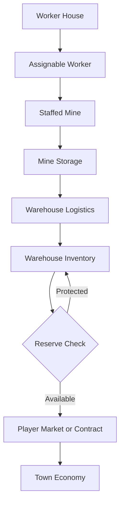

# Economy and Logistics

## Existing market layers

Pinebarrow has related but distinct economic systems:

- **Marketplace:** player-priced sell offers can fill partially or remain listed depending on demand.
- **Company contracts:** a business requests a significant quantity at a stated unit price; an assigned truck cycles until fulfillment.
- **Town Hall road contracts:** the player surveys a turning, two-tile-wide route; approval purchases required stone and labor at live prices, influencing stone demand.
- **Town development:** founding supply contracts produce Coming Soon sites and later businesses, which add persistent demand and news.

These systems should remain separate in the interface while sharing the same material-price economy.

## Intended industrial flow

## Workforce rules

- One Worker House provides one worker.
- A mine requires one assigned worker to produce.
- A warehouse requires one assigned worker to collect or dispatch stock.
- A player market requires one assigned worker to transfer and sell stock.
- Removing or reassigning a worker stops the affected operation without losing stored material.

## Warehouse rules

Warehouses collect material from assigned mines at a fixed logistics rate. Their upgrades are separate:

| Upgrade | Changes | Does not automatically change |
|---|---|---|
| Capacity | Maximum stored tonnage | Collection speed |
| Logistics | Collection/transfer rate | Maximum storage |
| Appearance | Visible development state | Economic statistics unless explicitly paired |

The UI must expose the actual bottleneck. A large warehouse with weak logistics can still leave mine storage full.

## Reserves

Reserve is protected warehouse inventory.

`available = max(0, inventory - reserve)`

Example: 175 tons of iron with a 100-ton reserve exposes 75 tons to automated market transfers. The player market stops drawing iron when inventory reaches 100 tons.

Reserves should ultimately be configurable per material. Contracts must not consume reserve stock unless a future explicit option allows it.

## Player Market

The buildable player market occupies 2×6 tiles inside the player claim. It automates movement from eligible warehouse inventory into the existing town market; it does not invent a separate price table.

Independent future upgrades:

- transfer/sales throughput
- local inventory capacity
- number of simultaneously handled materials
- appearance

## Materials and mine progression

The survey establishes the starting seam. Drill levels 3, 5, and 7 can advance to the next material allowed by the mine's forest-depth band.

| Depth | Available progression |
|---:|---|
| 0–24 | Stone → Clay → Coal |
| 25–59 | Coal → Iron → Copper → Tin |
| 60–94 | Iron → Copper → Tin → Quartz → Silver |
| 95–124 | Quartz → Silver → Gold → Sapphire |

Mine upgrades improve production and local storage, but must not bypass the depth band's maximum material. Mine Management should show the current seam, next reachable seam, required drill level, and depth limit.

## Required bottleneck messages

- `NO WORKER`
- `MINE STORAGE FULL`
- `WAITING FOR TRUCK`
- `WAREHOUSE FULL`
- `WAREHOUSE LOGISTICS BACKLOG`
- `RESERVE PROTECTED`
- `MARKET THROUGHPUT FULL`
- `CONTRACT SOURCE EMPTY`

Silent production failure is a bug.
