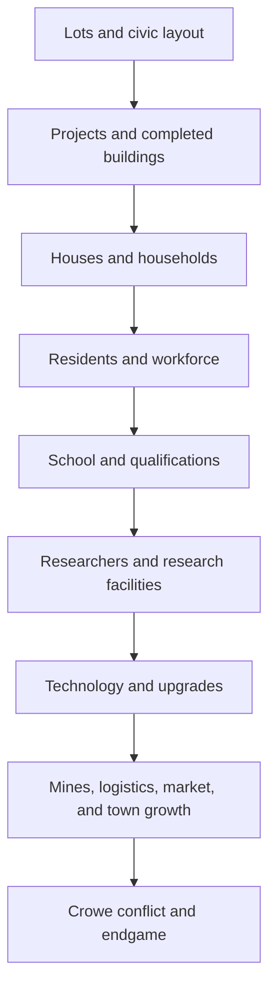

# Pinebarrow Land Company — Full Game Content Contract

**Status:** Scope contract for the complete in-development game
**Baseline:** `main` `2c65ba7431b18d5514321cdd2d14cddb08f9128f`
**Active implementation branch:** `phase-5-project-construction` / PR #14
**Related operating rule:** `docs/DEVELOPMENT_CADENCE.md`

## Decision

The game is being designed as a complete system now. Implementation checkpoints control the size of each code change and protect the work from usage-limit interruptions; they do not define a succession of mediocre feature releases or permit the core design to drift.

This document is the scope authority for the full game. A checkpoint may leave a system temporarily incomplete while its code is being built, but the final data model, dependency, player-facing route, save behavior, and acceptance test are defined here before that work begins.

Every meaningful checkpoint must end with a verified GitHub commit. If a session ends unexpectedly, the next session resumes from that commit and this document—not memory or chat reconstruction—is the handoff.

## Player promise

Pinebarrow is a living company-building campaign in which the player:

- surveys land, leases or purchases opportunities, and grows a mining company;
- develops houses, shops, civic buildings, mines, warehouses, research facilities, and industry through visible projects;
- creates a population and labor pool instead of receiving workers from a menu;
- educates residents, develops scholars and researchers, and converts knowledge into better tools and facilities;
- manages mines, stockpiles, hauling, reserves, contracts, shops, rent, ownership, and upgrades;
- competes with Silas Crowe, whose buildings, wealth, waste recovery, and expansion use the same economic rules;
- visibly changes Pinebarrow from a small settlement into a connected town and industrial center; and
- reaches the bridge, Golden City, ownership, and endgame decisions through recorded economic and narrative consequences.

The game should feel deep because systems interact, not because the player must operate a collection of disconnected menus.

## Non-negotiable design rules

### 1. One project mechanism for every physical development

Any building that exists in the world is created or improved through the shared project spine:

`site or purchase agreement -> permission or ownership check -> design -> builder bids -> construction contract -> material supply -> logistics -> hauling -> labor and time -> completion -> ownership -> management`

This applies to houses, house upgrades, mines, warehouses, shops, player industry, schools, research facilities, and Crowe buildings.

There are two valid entry routes:

- **Player/town development:** Town Hall site approval creates a permitted development proposal.
- **Town infrastructure:** a purchase agreement selects an existing town opportunity and skips only site approval; construction, procurement, delivery, labor, ownership, and management still apply.

There is no instant cash-only building button hidden behind a screen.

### 2. Houses are real property, not menu capacity

Residential houses must have a lot, footprint, construction state, completed world representation, owner, upgrade level, household capacity, resident records, and management state. A house may be proposed, bid, supplied, built, upgraded, sold, and eventually replaced through the same project mechanism.

Housing provides a place to live. It does not automatically create a worker. Residents enter the population and labor systems, become candidates according to the rules, and are hired into actual jobs.

### 3. Population precedes workforce

The final population relationship is:

`house -> household -> residents -> labor pool -> candidate -> hire -> assignment -> activity -> skill/qualification -> wages -> housing/consumption`

A workforce record is a job relationship, not a second population. Removing or selling a house, shop, mine, or warehouse must resolve affected relationships visibly and safely; it must not silently delete people or assignments.

### 4. Education is a real progression path

The School is a real civic building in the town layout and is present as an early visible institution. It has capacity, staffing, operating costs, student enrollment, curriculum/training progress, and upgrade levels.

Residents can become students. A student who reaches the configured education and experience threshold can become a qualified scholar candidate. A qualified scholar can become a researcher when the company has an eligible research role and the required facility.

Education changes what residents can do; it is not decorative flavor text.

### 5. Research is a real construction and knowledge system

Research facilities are separate buildings that become available through the school/qualification/story prerequisites and are then built through a proposal or purchase agreement. They have a construction project, workforce requirement, operating state, upgrade path, research queue, inputs, and outputs.

Research produces company knowledge and unlocks or improves technologies such as mine attachments, shaker performance, stockpile/loading equipment, warehouse logistics, market throughput, and later civic or industrial options. Unlocking a technology does not instantly build or buy the improved equipment.

### 6. Production is gated by people, materials, logistics, and reserves

Mines, warehouses, shops, schools, research facilities, markets, and industry must expose their operating requirements. A missing worker, input, route, storage slot, or contract puts the activity into a safe stopped or blocked state with a visible reason. No system may silently invent output to make a screen look complete.

### 7. Definitions are configuration; active work is snapshotted

Building definitions, upgrade definitions, curricula, qualifications, research nodes, mine tracks, logistics rules, prices, and balance tables are data/configuration. A construction, upgrade, contract, enrollment, or research job snapshots the requirements it was awarded under so later balance edits cannot rewrite work already in progress.

### 8. Crowe follows the same rules

Crowe may have different priorities, money, timing, and narrative decisions, but his houses, crew housing, workshop, warehouses, estate, research, acquisitions, and visible wealth use the same project, provider, labor, logistics, ownership, and ledger records. Crowe never receives an invisible building or workforce.

### 9. Stable IDs and migrations are part of the feature

Every persistent lot, building, household, resident, worker, project, contract, research job, mine, stockpile, lease, sale, and narrative milestone has a stable ID. Schema migration is idempotent, bounded, loss-averse, and tested against the production baseline and every immediately preceding schema.

### 10. Intermediate checkpoints must be playable and recoverable

An intermediate checkpoint may be visually plain, but it must load, save, and fail safely. No checkpoint may leave the repository dependent on an uncommitted chat-only patch.

## Complete content inventory

| System | Full-content commitment | Depends on |
|---|---|---|
| World and lots | A fixed single-player town layout with roads, blocks, frontage, mine parcels, player frontier, Crowe reserve, civic buildings, housing lots, commercial lots, research land, and future-industry space | World layout, stable lot IDs |
| Town Hall and permits | Site approval, development proposals, purchase agreements, builder bids, project ledgers, property management, sale, buy-back, and upgrade approval | Project spine, property records |
| Construction | Builder competition, material supply, warehouse staging, logistics, hauling, labor, deadlines, delayed states, completion, ownership, and visual site stages | Save records, contracts, inventory, workforce |
| Residential housing | Physical houses, household capacity, house tiers, quality, upkeep, resident occupancy, household movement, house upgrades, sale, and replacement | Lots, construction, population |
| Population | Households, residents, age/role state, living quality, consumption, availability, education status, employment status, and safe displacement rules | Houses, town economy |
| Workforce | Candidate selection, hiring, wages, skills, career tracks, qualification checks, assignments, vacancies, reassignment safety, and unemployment | Population, buildings |
| School | Existing civic school, staff, student seats, enrollment, curriculum, operating costs, education progress, school upgrades, and graduation/qualification events | Population, workforce, town layout |
| Scholar/researcher path | Scholar candidates, research qualification, researcher roles, experience, wages, and availability | School, workforce |
| Research | Research definitions, technology tree, knowledge ledger, research queues, inputs, facility requirements, unlocks, and upgrade effects | Scholars/researchers, research facilities |
| Research facilities | Proposal/purchase route, construction, staffing, operating state, research queue, capacity, attachments, upgrades, ownership, and sale | Construction, research |
| Mining | Excavation, active seam, shaker efficiency, stockpile capacity, loading/logistics, unlocked seams, dirt/tailings ledger, attachments, and mine upgrades | Research, workforce, warehouses |
| Warehousing | Warehouse capacity, collection/logistics, mine routing, reserves, available stock, hauling states, throughput, upgrades, and worker requirements | Mining, workforce, roads |
| Shops and property | Town shops, player shops, tenants, rent, operating workers, inventory/input requirements, upgrades, sale-at-any-time, town buy-back, and ownership history | Construction, property, workforce |
| Player market and industry | The 2×6 Player Market, reserve-eligible stock, sales throughput, town demand/prices, new industries, supplied materials, and industry upgrades | Warehouses, shops, research |
| Crowe and waste | Dirt Processor, tailings/waste recovery, Crowe acquisition fund, merchant debts, distressed deeds, crew housing, southern expansion, estate, and wealth visuals | Mining, logistics, property, narrative |
| Town growth | New residents, businesses, civic improvements, road/bridge projects, Golden City connection, future lots, and visible block completion | Property, economy, story |
| Narrative/endgame | Newspaper and event state, Crowe conflict, ownership vote, bridge reveal, final company/town outcomes, and replay-safe milestones | All major ledgers |
| UI and controls | Town Hall ledgers, company operations, mine/warehouse/research management, house/property detail, workforce, school, contracts, controller/touch/mouse/keyboard paths, and clear blocked reasons | All player-facing systems |
| Save/deploy quality | Versioned saves, migration fixtures, deterministic tests, production build, lint, browser smoke, exact-SHA deployment, and changelog | Every system |

## Canonical dependency flow

No later system should invent a shortcut around an earlier dependency. A research unlock may make a building or upgrade available; it does not bypass its construction and operating requirements.

## Canonical records

The exact field names may evolve during implementation, but these records and relationships are required before final release.

| Record family | Required records and responsibilities |
|---|---|
| Save/profile | Profile version, migration metadata, stable ID counters, company cash/cargo, time, inventory, and bounded collections |
| World/property | Lot, parcel, frontage, BuildingDefinition, BuildingUpgradeDefinition, DevelopedBuilding, PropertyOwnership, Lease, Sale, BuyBack |
| Project spine | DevelopmentProposal, PurchaseAgreement, ConstructionProject, ConstructionBid, ConstructionContract, ProcurementContract, Delivery, LaborProgress |
| People | Household, Resident, StudentEnrollment, Qualification, Skill/Career, WageLedger, PopulationEvent |
| Workforce | WorkforceRecord, JobVacancy, Assignment, Reassignment, WorkerAvailability, OperatingRequirement |
| Education | School, SchoolTerm, Curriculum, Class, StudentProgress, Graduation/QualificationEvent |
| Research | ResearchDefinition, TechnologyNode, KnowledgeLedger, ResearchFacility, ResearchProject, ResearchOutput, ResearchUpgrade |
| Mining/logistics | Mine, MineTrack, ActiveSeam, Stockpile, DirtLedger, Warehouse, Route, HaulingJob, Reserve |
| Commerce | Shop, Market, Industry, Tenant, Demand, Price, RentLedger, SalesLedger |
| Crowe/story | CroweLedger, CroweProject, Acquisition, Debt, DistressedDeed, NewspaperEvent, NarrativeMilestone, EndgameState |

Every record that can be referenced by another record must have a stable ID and a safe missing-reference policy. A missing project, house, worker, or research job must produce a blocked/recovery state and a visible reason, not a silent deletion.

## Building and upgrade contract

All physical definitions use the same conceptual shape:

- identity, family, display name, footprint, lot rules, frontage/access rules;
- owner/controller and permitted entry route;
- construction materials, builder qualification, labor, duration, deadline policy;
- workforce requirements and operating inputs/outputs;
- capacity and quality effects;
- allowed upgrades and prerequisites;
- management actions, sale rules, rent/lease rules, and visual states.

An upgrade is a project against an existing building. The original building ID, ownership, residents, tenants, contracts, and historical ledger remain stable while the upgrade creates a new project and applies its snapshot on completion. Upgrade actions must be safe when the building is occupied, staffed, rented, or temporarily stopped.

## Housing, school, scholar, and research rules

The intended player-facing chain is:

1. Town Hall exposes an approved residential lot.
2. The player selects a house design and enters the builder/material/logistics/hauling project.
3. The completed house appears on the map and contributes its configured household capacity.
4. Households move in or are created according to population rules; residents have names, status, living quality, and availability.
5. A resident may work, study, or remain unavailable according to age, household, education, and town rules.
6. The School enrolls eligible residents and advances their education through staffed classes and time.
7. A student who meets the configured threshold becomes a scholar candidate; a research role and facility can promote that candidate to researcher.
8. A researcher operates a completed research facility, consumes its inputs/time, and advances a technology node.
9. The unlocked technology changes what can be proposed, built, attached, or upgraded; it never skips the project or procurement path.

The school is visible before research is available. Research facilities are unlocked content, then built and managed like every other physical asset. Houses have multiple upgrade tiers; higher tiers change capacity, quality, upkeep, and/or household eligibility through configuration rather than hard-coded one-off behavior.

## Full implementation checkpoints

These are implementation boundaries, not separate game designs. Each checkpoint can be split into numbered sub-checkpoints if the code surface is too large for one usage window; every sub-checkpoint is committed and verified before the next begins.

| Checkpoint | Scope | It is complete when |
|---|---|---|
| C0 — Scope lock | Commit this full-content contract, dependency order, record families, and checkpoint protocol | The contract is on the active GitHub branch and referenced by the cadence document |
| C1 — Canonical data and migration | Add the final record families/normalizers in compatible form; preserve v14 behavior and add legacy/current fixtures | A save can load, normalize, save, and reload without losing v14 projects, property, workforce, or future records |
| C2 — Physical lots and residential playability | Make approved residential lots selectable, placeable, project-backed, rendered through construction stages, and complete as real house records | A fresh profile can approve a house site, award contracts, advance time, see the completed house, and open its detail/management view |
| C3 — Population and upgradeable housing | Replace temporary one-house/one-resident assumptions with households/residents, housing quality, occupancy, movement/sale safety, and house upgrades | House tiers change configured capacity/quality through an upgrade project; residents and assignments survive reload and safe ownership changes |
| C4 — Workforce and careers | Complete vacancies, hiring, wages, skills, career tracks, mine/warehouse/shop/school/research assignments, and reassignment safety | A resident can move from candidate to worker to assigned job; each operating building stops safely when its requirement is unmet |
| C5 — School and scholar progression | Add the visible School, staff/class capacity, student enrollment, curriculum progress, graduation, and scholar qualification | A resident can become a student, complete education, become a scholar candidate, and remain represented in saved state/UI |
| C6 — Research registry and knowledge | Add technology nodes, prerequisites, knowledge ledger, research queue, unlock effects, and researcher eligibility | A qualified scholar can become a researcher and advance a deterministic research job without granting instant buildings/equipment |
| C7 — Research facilities | Add the facility definitions, proposal/purchase route, construction, staffing, operation, inputs, outputs, upgrades, and ownership | A research facility is unavailable before its prerequisite, then can be built and upgraded through the shared project spine |
| C8 — Mine architecture | Split mine progression into Excavation, Active Seam, Shaker, Stockpile, Loading/Logistics, unlocked seams, attachments, and dirt/tailings ledger | Existing mine saves migrate safely; each track changes only its documented capability and production remains worker/logistics gated |
| C9 — Warehouse and hauling | Add deterministic mine routing, warehouse collection/capacity, reserves, available stock, hauling jobs, bottlenecks, and logistics upgrades | Material flows from mine to warehouse to project/market with visible backlog/full/unstaffed states and no duplicated inventory |
| C10 — Shops, market, and industry | Complete rentable town shops, player market, tenant/workforce operation, demand/prices, future industry lots, and upgrade projects | A shop can be built, staffed, rented, upgraded, sold, bought back, and safely recovered; the market consumes only reserve-eligible stock |
| C11 — Crowe and waste economy | Add Dirt Processor, tailings/recovery, Crowe fund/debts/deeds, crew housing, southern expansion, estate, and recorded wealth visuals | Crowe's expansion and visible wealth are explainable from real projects, contracts, waste, property, and ledger history |
| C12 — Town growth and endgame | Add civic growth, roads/bridges, Golden City connection, newspaper/story milestones, ownership vote, and final outcomes | Major milestones respond to actual company/town state and persist through save/load without duplicate rewards |
| C13 — Full integration and release | Full migration/regression suite, build, lint, manual browser/controller/touch smoke, exact-SHA merge and deployment | The tested GitHub `main` SHA is the deployed SHA, the live flow is smoke-tested, and the changelog names the release |

## Checkpoint acceptance contract

Every implementation checkpoint must include the smallest complete slice of these concerns that its scope requires:

- canonical source change;
- save/load and idempotent migration behavior;
- player-facing route or an explicit documented reason the UI follows in the next sub-checkpoint;
- focused regression fixtures, including one existing-save fixture when state changes;
- safe blocked/error state with a visible explanation;
- focused test/build/lint evidence;
- a committed handoff with exact branch and commit SHA.

The full integration gate is the only point at which the entire suite, production build, lint, merge to `main`, exact-SHA deployment, and live smoke test are required together. Intermediate mechanics commits are not public releases, but they are always recoverable GitHub checkpoints.

## Usage-limit and resume protocol

### Before work

1. Fetch the active branch head and record its SHA.
2. Read this contract and `docs/DEVELOPMENT_CADENCE.md`.
3. Select exactly one checkpoint or sub-checkpoint.
4. Inspect only the canonical source and tests needed for that checkpoint.

### During work

1. Keep one coherent behavior in flight.
2. Prefer a configuration/record addition before adding UI special cases.
3. Do not rewrite the engine or replace current files with a historical branch wholesale.
4. Do not begin an unrelated phase while a checkpoint is uncommitted.

### Before ending the turn

1. Run focused checks.
2. Commit the checkpoint immediately to GitHub.
3. Fetch the branch again and verify the new SHA and changed paths.
4. Record what is complete, what is intentionally deferred, and the exact next checkpoint.
5. Leave no required work only in chat, scratch files, or an unpushed local branch.

### If usage ends or a session is interrupted

Resume from the last verified branch SHA. Do not reconstruct half-finished code from conversation memory. If the last commit is green but the checkpoint is not complete, finish that same checkpoint; if it is complete, start only the recorded next checkpoint.

## Current status and next action

The active v24 branch already provides the shared project/construction/property/workforce/Crowe foundation: schema v14 records, builder and procurement stages, delivery/labor/deadlines, completed house/mine/warehouse/shop records, explicit workforce assignment, production stoppage without a worker, rent/sale/buy-back, and Crowe's project path.

The v24 branch is not yet the complete game. In particular, the normal player-facing residential placement path, final household model, house upgrades, School, scholar/researcher progression, research facilities, and the later mine/logistics/market/Crowe layers still need to be implemented under this contract.

After the v24 merge gate is satisfied, the next runtime checkpoint is **C2 — Physical lots and residential playability**. It must turn the current house records/menu surface into an actual lot-to-project-to-completed-house experience before population and education are layered on top.

Numeric costs, capacities, progression thresholds, recovery odds, and prices remain tunable configuration. The content and dependency commitments above are not optional balance placeholders; they are the systems the final game must contain.

